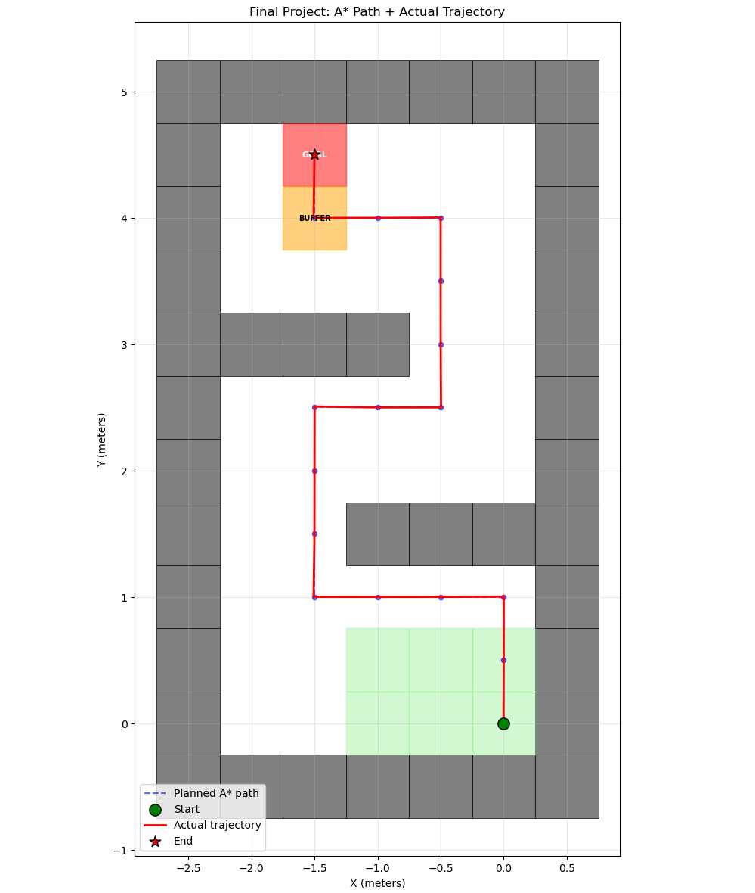

# RoboticBasic

本仓库整理了机器人学基础课程的实验代码、实验报告与运行结果，内容覆盖
TurtleBot 移动机器人控制、ReactorX 150 机械臂运动学、轨迹生成、A* 运动规划，
以及将上述方法组合起来的期末自主导航项目。

## 主要内容

| 目录 | 主题 | 主要实现 |
| --- | --- | --- |
| `Lecture1` | 仿真环境 | TurtleBot3、ReactorX 150 环境与实验报告 |
| `Lecture2` | 开环控制 | 通过 `/cmd_vel` 控制 TurtleBot 走正方形 |
| `Lecture3` | 闭环控制 | 基于 `/odom` 反馈和 PD 控制器跟踪路标点 |
| `Lecture4` | 实验记录 | 作业与运行结果截图 |
| `Lecture5` | 正向运动学 | 三角法、D-H 参数法和指数积（PoE）法 |
| `Lecture6` | 逆向运动学 | 解析法与数值法 |
| `Lecture7` | 轨迹生成 | 三次多项式轨迹生成与闭环跟踪 |
| `Lecture8` | 运动规划 | 四连通网格上的 A* 最短路径规划 |
| `Final` | 期末项目 | A* 路径规划、轨迹生成及 TurtleBot 自主导航 |

各目录中的 PDF/WPS 文件为实验要求或实验报告，`Project*` 目录包含对应代码和结果。

## 环境要求

- Ubuntu（推荐使用与 ROS 2 版本匹配的 Ubuntu 版本）
- Python 3
- ROS 2
- Gazebo 与 TurtleBot3 仿真包
- Python 包：NumPy、Matplotlib、Modern Robotics
- ROS 相关包：`rclpy`、`geometry_msgs`、`nav_msgs`、`sensor_msgs`、
  `tf_transformations`

普通 Python 依赖可安装为：

```bash
python3 -m pip install numpy matplotlib modern_robotics
```

ROS 2 及 TurtleBot3 请按照所用发行版的安装方式配置。运行 ROS 程序前，需要加载
环境并指定机器人型号：

```bash
source /opt/ros/$ROS_DISTRO/setup.bash
export TURTLEBOT3_MODEL=burger
```

## 获取项目

```bash
git clone https://github.com/OliviaWYQ/RoboticBasic.git
cd RoboticBasic
```

建议从仓库根目录运行各模块，以便 Python 正确解析 `Lecture*` 包路径。

## 运行示例

### A* 运动规划

```bash
python3 -m Lecture8.Project8.test_motion_planning
```

程序会在终端打印规划路径，并通过 Matplotlib 显示网格、障碍物与最短路径。

### 正向与逆向运动学

以下节点会计算测试用例，并向 ReactorX 150 的关节状态话题发布结果：

```bash
python3 -m Lecture5.Project5.test_forward_kinematics
python3 -m Lecture6.Project6.test_inverse_kinematics
```

正向运动学会比较三角法、D-H 法和 PoE 法；逆向运动学会比较解析解与数值解。

### TurtleBot 控制实验

启动 TurtleBot3 仿真后，可在另一个已加载 ROS 2 环境的终端运行：

```bash
python3 Lecture2/Project2/open_loop.py
python3 Lecture3/Project3/closed_loop.py
python3 Lecture7/Project7/trajectory_generation.py
```

这些程序均向 `/cmd_vel` 发布速度命令；闭环与轨迹实验还会订阅 `/odom`。一次只应运行
一个控制节点，按 `Ctrl+C` 停止。

## 期末项目

期末项目位于 `Final/Project`，其流程为：

1. 在 7 × 12 网格地图上使用 A* 规划路径；
2. 强制路径经过橙色缓冲格，再进入红色目标格；
3. 将网格路径转换为三次多项式轨迹；
4. 根据里程计反馈进行闭环跟踪；
5. 将实际轨迹保存到 `trajectory.csv`。

无需 ROS 2 即可检查默认起点的规划结果：

```bash
python3 Final/Project/turtlebot.py --plan-only
```

在 ROS 2/Gazebo 环境中，可先生成并启动网格世界：

```bash
python3 Final/Project/generate_world.py
ros2 launch Final/Project/grid_world.launch.py
```

然后打开另一个终端：

```bash
source /opt/ros/$ROS_DISTRO/setup.bash
export TURTLEBOT3_MODEL=burger
cd RoboticBasic/Final/Project
python3 turtlebot.py
```

默认起点为网格 `(5, 10)`。也可以通过 ROS 2 参数选择其他绿色起点，例如：

```bash
python3 turtlebot.py --ros-args -p start_col:=3 -p start_row:=9
```

任务结束后，在同一目录绘制规划路径和实际轨迹：

```bash
python3 visualization.py
```

更完整的参数、坐标系与话题重映射说明见
[`Final/代码说明.md`](Final/代码说明.md)。



## 注意事项

- ROS 节点默认使用 `/cmd_vel` 和 `/odom`；若仿真使用命名空间，请通过 ROS 2
  remapping 修改话题。
- `trajectory.csv` 会写入运行命令所在的当前目录。
- Gazebo 和 TurtleBot3 的可用启动文件会随 ROS 2 发行版而变化；若启动失败，请确认
  已安装与当前发行版匹配的 `gazebo_ros` 和 `turtlebot3_gazebo`。
- 仓库当前未声明开源许可证；如需复制、修改或分发代码，请先联系仓库作者。
